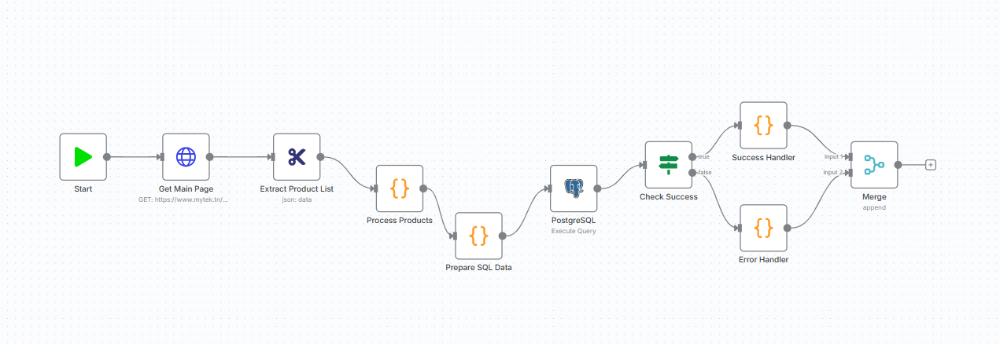
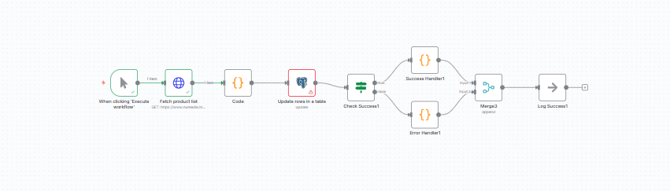
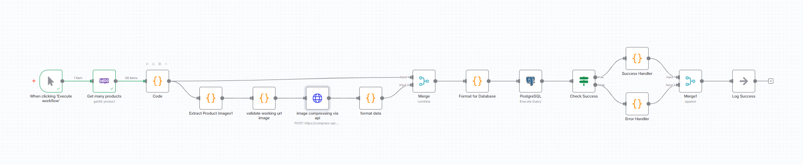
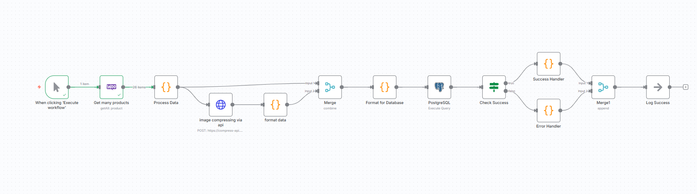
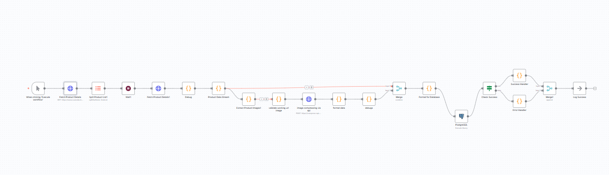
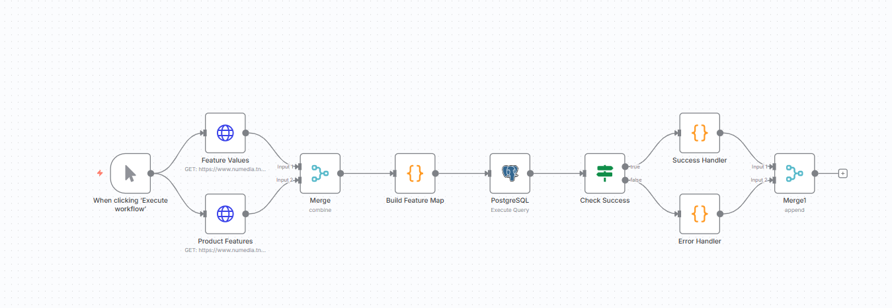
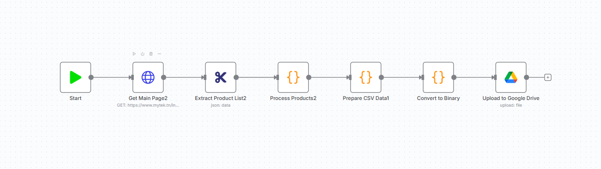

# n8n-Scraping-workflows
## 🖼️ Data Processing Workflows

### Workflow: Product Extraction and Database Insertion

This workflow retrieves product data, processes it, and inserts it into a PostgreSQL database.
![PostgreSQL Insertion Workflow]

---

### Workflow: Product Data Update

This workflow is triggered manually and is responsible for fetching updated product information and updating existing rows in the table.
![Database Update Workflow]

---
## ⚙️ Automated Workflow Diagrams

These diagrams illustrate the logical flow and processing steps for various data operations within this system, including product retrieval, image processing, database updates, and data export.

### 1. Product Data Retrieval and Image Processing Workflows

These workflows handle fetching product lists, processing associated images (validation, compression), and persisting the data into a PostgreSQL database.

| Diagram Title | Description | 
| :--- | :--- | :--- |
| **Product Retrieval, Image Processing, and DB Insertion (V1)** | Fetches multiple products, processes image data through a validation/compression sequence, merges the results, formats for the database, executes the PostgreSQL query, and logs success/error. | 
| **Product Retrieval, Image Processing, and DB Insertion (V2)** | A revised version where product data is processed first (`Process Data`), followed by parallel image compression and formatting before merging and executing the DB query. | 
| **Detailed Product Data, Image Processing, and DB Insertion** | A complex workflow involving initial fetching, debugging, detailed data extraction, parallel image processing (extract, validate, compress), merging, and final DB insertion. | 
#### Workflow V1: Image Processing and DB Insertion
![Product Retrieval, Image Processing, and DB Insertion Workflow V1]

---

#### Workflow V2: Image Processing and DB Insertion
![Product Retrieval, Image Processing, and DB Insertion Workflow V2]

---

#### Detailed Extraction and Image Processing
![Detailed Product Data, Image Processing, and DB Insertion Workflow]

---

### 2. Core Data Extraction and Database Load

These focus on initial data extraction, preparation, and bulk loading into the database.

| Diagram Title | Description | 
| :--- | :--- | :--- |
| **Main Page Extract, Process, and PostgreSQL Load** | Extracts product lists from a main page URL, processes the data, prepares the SQL statements, executes the PostgreSQL query, and handles success/error logging. |
| **Feature Data Merge and PostgreSQL Load** | Fetches two distinct data streams (`Feature Values` and `Product Features`) via API calls, merges the results, builds a feature map, and inserts the structure into PostgreSQL. | 

#### Main Page Extract and PostgreSQL Load
![Main Page Extract, Process, and PostgreSQL Load Workflow]

---

#### Feature Data Merge and PostgreSQL Load
![Feature Data Merge and PostgreSQL Load Workflow]

---

### 3. Database Update and Data Export Workflows

These cover periodic updates and final data output.

| Diagram Title | Description |
| :--- | :--- | :--- |
| **Product List Fetch and Database Update** | Fetches an external product list, processes it using custom code, updates existing rows in a table, checks for success, and logs the outcome. | 
| **Data Extraction, CSV Preparation, and Google Drive Export** | Extracts data from a URL, processes it, prepares the final data structure, converts it to binary (for file handling), and uploads the resulting file to Google Drive. | 

#### Product List Fetch and Database Update
![Product List Fetch and Database Update Workflow]

---

#### Data Extraction and Google Drive Export
![Data Extraction, CSV Preparation, and Google Drive Export Workflow]
